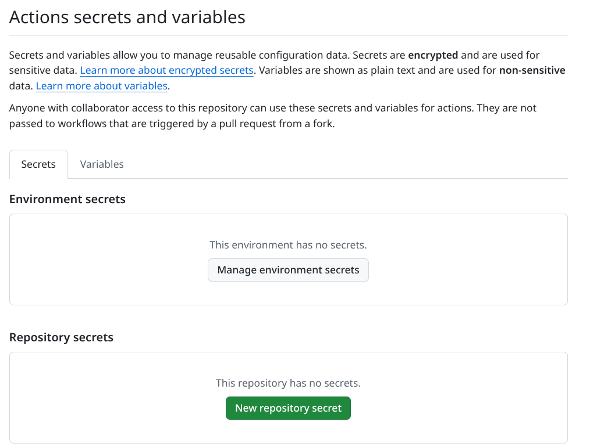

# CI and D1 Secrets

Secret management in GoFlare is based on the CI platform (GitHub Actions).

## Manual Configuration

1. **Create the D1 database** in the Cloudflare dashboard: Workers & Pages → D1 → Create database.
2. **Get the credentials**:
   - `CLOUDFLARE_ACCOUNT_ID`: In the dashboard's right sidebar.
   - `D1_DATABASE_ID`: In your D1 database settings.
   - `CLOUDFLARE_API_TOKEN`: Create one in My Profile → API Tokens → Edit Workers.
3. **Register them in GitHub**:
   - Go to your repo → Settings → Secrets and variables → Actions.
   - **Secrets**: `CLOUDFLARE_API_TOKEN`, `CLOUDFLARE_ACCOUNT_ID`.
   - **Variables**: `D1_DATABASE_ID`.

## Behavior by environment

| Environment | Token | Behavior |
|---|---|---|
| Local | `os.Getenv` | Uses the environment variable if it exists. `goflare auth --check` to validate. |
| CI (GitHub Actions) | `secrets.*` | Automatically injected by the workflow. |
| PR from Forks | Empty | Integration tests are automatically skipped (`t.Skip`). |
