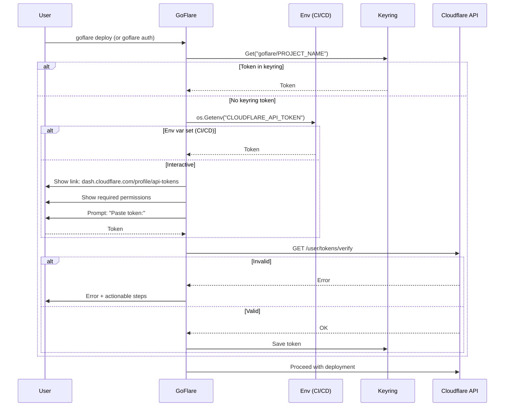

# goflare — Developer Experience Plan

## Objetivo

Un desarrollador junior debe poder ejecutar `goflare deploy` por primera vez
sin consultar documentación externa. Todo el contexto necesario debe aparecer
en la terminal en el momento correcto.

---

## Problema 1 — Prompt de token sin contexto (crítico)

### Estado actual

```
$ goflare deploy
Cloudflare API Token:
```

El desarrollador no sabe:
- Qué es un API Token de Cloudflare
- Dónde obtenerlo
- Qué permisos necesita
- Si se guardará o se pedirá cada vez

### Fix — `auth.go`

Reemplazar el prompt vacío por un bloque informativo antes de pedir el token:

```go
// Before:
fmt.Fprint(os.Stderr, "Cloudflare API Token: ")

// After:
fmt.Fprintln(os.Stderr, "")
fmt.Fprintln(os.Stderr, "Cloudflare API Token required.")
fmt.Fprintln(os.Stderr, "")
fmt.Fprintln(os.Stderr, "  1. Go to: https://dash.cloudflare.com/profile/api-tokens")
fmt.Fprintln(os.Stderr, "  2. Click \"Create Token\" → use template \"Edit Cloudflare Workers\"")
fmt.Fprintln(os.Stderr, "     Add permission: Cloudflare Pages — Edit")
fmt.Fprintln(os.Stderr, "")
fmt.Fprintln(os.Stderr, "  Token is saved to your system keyring — only asked once per project.")
fmt.Fprintln(os.Stderr, "")
fmt.Fprint(os.Stderr, "Paste token: ")
```

### Permisos mínimos requeridos para el token

Documentar en README y en el prompt en caso de error de permisos:

| Recurso | Permiso |
|---------|---------|
| Workers Scripts | Edit |
| Cloudflare Pages | Edit |
| Account Settings | Read (para verificar token) |

---

## Problema 2 — Error de token inválido sin guía

### Estado actual

```
invalid token: CF API error: ... (code: 1000)
```

Error técnico, sin acción sugerida.

### Fix — `auth.go` en `validateToken`

Envolver el error con mensaje accionable:

```go
func (g *Goflare) validateToken(token string) error {
    if err := client.get("/user/tokens/verify"); err != nil {
        return fmt.Errorf(
            "%w\n\nToken validation failed. Check:\n"+
            "  - Token is not expired\n"+
            "  - Token has Workers Scripts (Edit) + Pages (Edit) permissions\n"+
            "  - Token is for the correct Cloudflare account\n\n"+
            "To reset saved token: goflare auth --reset",
            err,
        )
    }
    return nil
}
```

---

## Problema 3 — No hay comando `goflare auth` dedicado

### Estado actual

Auth solo ocurre como parte de `deploy`. No hay forma de:
- Autenticarse antes del deploy
- Verificar que el token guardado es válido
- Resetear el token sin borrar manualmente el keyring

### Fix — nuevo subcomando `goflare auth`

```
goflare auth           # guarda/verifica token (interactivo si no hay token)
goflare auth --reset   # borra token del keyring y pide uno nuevo
goflare auth --check   # verifica token guardado sin pedir nada, exit 0/1
```

**`run.go` — añadir `RunAuth`:**

```go
func RunAuth(envPath string, in io.Reader, out io.Writer, reset bool, check bool) error {
    cfg, err := LoadConfigFromEnv(envPath)
    if err != nil {
        return err
    }
    g := New(cfg)
    store := NewKeyringStore()

    if reset {
        store.Delete("goflare/" + cfg.ProjectName)
        fmt.Fprintln(out, "Token reset. Run goflare auth to set a new one.")
        return nil
    }

    if check {
        token, err := g.GetToken(store)
        if err != nil {
            fmt.Fprintln(out, "No token saved.")
            return err
        }
        if err := g.validateToken(token); err != nil {
            fmt.Fprintln(out, "Token invalid:", err)
            return err
        }
        fmt.Fprintln(out, "Token OK.")
        return nil
    }

    return g.Auth(store, in)
}
```

**`cmd/goflare/main.go` — añadir case:**

```go
case "auth":
    reset := fs.Bool("reset", false, "delete saved token")
    check := fs.Bool("check", false, "verify saved token")
    fs.Parse(os.Args[2:])
    err = goflare.RunAuth(*env, os.Stdin, os.Stdout, *reset, *check)
```

---

## Problema 4 — `CLOUDFLARE_API_TOKEN` env var no soportada

### Estado actual

No hay forma de inyectar el token sin interacción (CI/CD, scripts).

### Fix — `auth.go` leer env var como fallback

```go
func (g *Goflare) Auth(store Store, in io.Reader) error {
    key := "goflare/" + g.Config.ProjectName

    // 1. Keyring
    token, err := store.Get(key)
    if err == nil && token != "" {
        return nil
    }

    // 2. Env var (CI/CD, scripts)
    if t := os.Getenv("CLOUDFLARE_API_TOKEN"); t != "" {
        if err := g.validateToken(t); err != nil {
            return err
        }
        store.Set(key, t)
        return nil
    }

    // 3. Interactive prompt (with context)
    ...
}
```

---

## Problema 5 — `goflare init` no pide el Account ID con link

### Estado actual (`init.go:35`)

```go
ask("Cloudflare Account ID (see dash.cloudflare.com -> right sidebar):", true)
```

Texto plano, sin formato. No distinguible del resto de prompts.

### Fix — contexto visual al pedir Account ID

```go
fmt.Fprintln(out, "")
fmt.Fprintln(out, "  Account ID: dash.cloudflare.com → right sidebar → copy Account ID")
fmt.Fprintln(out, "")
cfg.AccountID, err = ask("Cloudflare Account ID:", true)
```

---

## Problema 6 — `goflare deploy` no muestra el Worker URL real

### Estado actual (`run.go:78`)

```go
URL: fmt.Sprintf("https://%s.<your-subdomain>.workers.dev", cfg.WorkerName),
```

`<your-subdomain>` es un placeholder que requiere que el dev busque su subdominio en el dashboard.

### Fix — obtener el subdominio vía API Cloudflare

Endpoint: `GET /accounts/{account_id}/workers/subdomain`

```go
func (g *Goflare) getWorkerSubdomain(client *cfClient) (string, error) {
    path := fmt.Sprintf("/accounts/%s/workers/subdomain", g.Config.AccountID)
    data, err := client.get(path)
    if err != nil {
        return "", err
    }
    var result struct {
        Subdomain string `json:"subdomain"`
    }
    json.Unmarshal(data, &result)
    return result.Subdomain, nil
}
```

Deploy summary muestra URL real:
```
[+] Worker: Success - https://my-worker.my-subdomain.workers.dev
[+] Pages:  Success - https://my-project.pages.dev
```

---

## Cambios por archivo

| Archivo | Cambio |
|---------|--------|
| `auth.go` | Prompt con link + permisos + keyring note; env var fallback; error accionable |
| `init.go` | Contexto visual al pedir Account ID |
| `run.go` | `RunAuth()`; `getWorkerSubdomain()` para URL real en summary |
| `cmd/goflare/main.go` | `case "auth"` con flags `--reset` y `--check` |
| `store.go` | Añadir método `Delete(key)` a la interfaz `Store` |
| `README.md` | Sección "First deploy" con flujo paso a paso; permisos del token |

---

## README — sección "First deploy" a añadir

```markdown
## First deploy

1. Run `goflare init` — creates `.env` with your project settings
2. Run `goflare build` — compiles WASM and prepares assets
3. Run `goflare deploy` — prompts for a Cloudflare API Token on first run

### Getting your API Token

Go to: https://dash.cloudflare.com/profile/api-tokens

Click **Create Token** → template **"Edit Cloudflare Workers"** → add:
- Cloudflare Pages — Edit

The token is saved to your **system keyring** (macOS Keychain, Linux Secret Service,
Windows Credential Manager). You will only be asked once per project.

### CI/CD (non-interactive)

Set the environment variable before running deploy:

    export CLOUDFLARE_API_TOKEN=your-token
    goflare deploy

### Reset saved token

    goflare auth --reset

### Verify saved token

    goflare auth --check
```

---

---

## Consistencia de modos (Pages-only / Worker-only / ambos)

El código en `run.go` y `build.go` ya soporta los tres modos correctamente:

| Modo | `ENTRY` | `PUBLIC_DIR` | Worker | Pages |
|------|---------|--------------|--------|-------|
| Worker-only | set | vacío | ✓ deploy | skip |
| Pages-only | vacío | set | skip | ✓ deploy |
| Ambos | set | set | ✓ deploy | ✓ deploy |

Este comportamiento **es correcto y consistente**. No requiere cambios en la lógica.

---

## Diagramas — inconsistencias a corregir

El diagrama `docs/diagrams/goflare-generic.md` tiene 5 nodos que no reflejan
ni el estado actual ni los cambios planificados en PLAN.md y DX_PLAN.md.

### Nodos incorrectos

| Nodo | Problema | Corrección |
|------|---------|------------|
| `COPY_DIST["Copy PUBLIC_DIR to .build/dist/"]` | Desaparece con Bug 2 fix (PLAN.md) | Eliminar — reemplazar por `WASM_COMPILE` + `ASSETS_GEN` como outputs directos a `PublicDir` |
| `D_HAS_DIST{"dist/ present?"}` | Deploy detecta `dist/` — post-fix debe detectar `PublicDir` files | Cambiar a `D_HAS_PUBLIC{"PublicDir has files?"}` |
| `ASK_ENTRY` label | Dice `default: web/server.go` | Correcto es `default: edge` (auto-detectado si existe `edge/main.go`) |
| `CMD_SWITCH` | No tiene rama `auth` | Añadir `CMD_SWITCH --> CMD_AUTH["auth"]` |
| `AUTH_FLOW.md` | No refleja env var `CLOUDFLARE_API_TOKEN` ni `goflare auth --reset/--check` | Reescribir |

### `AUTH_FLOW.md` — diagrama corregido



### `goflare-generic.md` — nodos BUILD a corregir

```
%% Before (remove):
COPY_DIST["Copy PUBLIC_DIR to .build/dist/"]

%% After (replace with):
HAS_FRONT -->|Yes| WASM_COMPILE["Compile web/client.go → PublicDir/client.wasm"]
WASM_COMPILE --> ASSETS_GEN["Generate script.js + style.css → PublicDir"]
ASSETS_GEN --> BUILD_DONE
```

```
%% Deploy detection — before:
D_HAS_DIST{"dist/ present?"}

%% After:
D_HAS_PUBLIC{"PublicDir has files?"}
```

```
%% Init prompt — before:
ASK_ENTRY["Prompt: Entry point? default: web/server.go  empty = Pages only"]

%% After:
ASK_ENTRY["Prompt: Entry dir? auto-detected if edge/main.go exists  empty = Pages only"]
```

```
%% CMD_SWITCH — add:
CMD_SWITCH --> CMD_AUTH["auth"]
```

### Archivos de diagrama a actualizar

| Archivo | Cambio |
|---------|--------|
| `docs/diagrams/goflare-generic.md` | 4 nodos corregidos (ver arriba) |
| `docs/diagrams/AUTH_FLOW.md` | Reescribir con env var + `goflare auth` |
| `docs/diagrams/DEPLOY_FLOW.md` | Cambiar `dist/` → `PublicDir` en target Pages |

---

## Checklist

- [ ] `auth.go` — prompt con link, permisos, keyring note
- [ ] `auth.go` — env var `CLOUDFLARE_API_TOKEN` como fallback
- [ ] `auth.go` — error de validación accionable con sugerencias
- [ ] `init.go` — contexto visual para Account ID
- [ ] `run.go` — `RunAuth()` con flags `reset` y `check`
- [ ] `run.go` — `getWorkerSubdomain()` para URL real en summary
- [ ] `cmd/goflare/main.go` — `case "auth"`
- [ ] `store.go` — método `Delete(key)` en interfaz `Store` + implementaciones
- [ ] `README.md` — sección "First deploy" con permisos y flujo completo
- [ ] `docs/diagrams/goflare-generic.md` — 4 nodos corregidos (COPY_DIST, D_HAS_DIST, ASK_ENTRY, CMD_AUTH)
- [ ] `docs/diagrams/AUTH_FLOW.md` — reescribir con env var + goflare auth
- [ ] `docs/diagrams/DEPLOY_FLOW.md` — dist/ → PublicDir en target Pages
