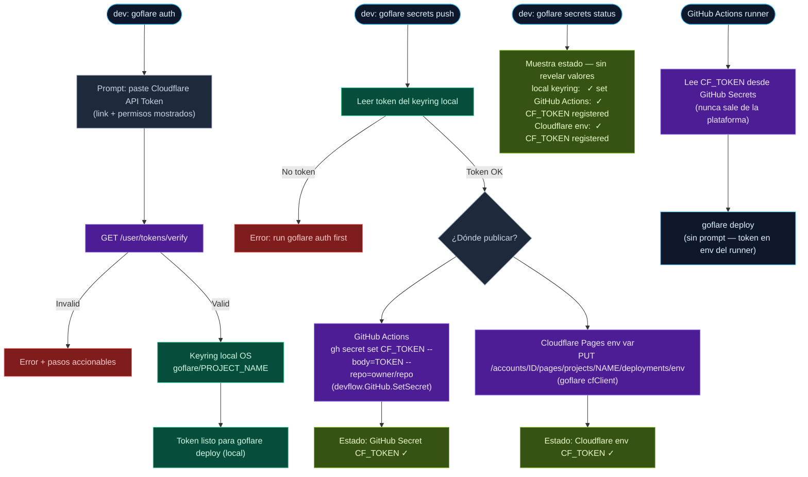

# goflare — Secrets Management Plan

## Principio

El token de Cloudflare **siempre vive en un keyring** — nunca en `.env`.
La diferencia entre local y CI/CD es solo *qué keyring* y *quién lo registró*:

| Contexto | Keyring | Quién registra el token |
|----------|---------|------------------------|
| Dev local | Sistema operativo (Keychain / libsecret / WinCred) | El dev, via `goflare auth` |
| GitHub Actions | GitHub Secrets (keyring de la plataforma) | El dev, via `goflare secrets push` |
| Cloudflare Pages CI | Cloudflare env vars (cifradas) | El dev, via `goflare secrets push` |

El `.env` solo contiene config no sensible (`PROJECT_NAME`, `PUBLIC_DIR`, etc.).
Nunca tokens. El estado de qué secretos están registrados dónde se puede mostrar
con `goflare secrets status` — sin revelar valores.

---

## Arquitectura — Responsabilidad por paquete

```
tinywasm/devflow
  Keyring          → almacenamiento local OS (ya existe)
  GitHub           → gh CLI wrapper (ya existe): CreateRepo, GetCurrentUser
  [nuevo] GitHub.SetSecret(repo, name, value)  → gh secret set
  [nuevo] GitHub.ListSecrets(repo)             → gh secret list

tinywasm/goflare
  store.go         → Store interface (KeyringStore ya existe)
  [nuevo] secrets.go → SecretManager: coordina keyring local + push a GitHub/CF
  [nuevo] cmd: goflare secrets push/status/reset
```

Cada paquete tiene una sola responsabilidad:
- `devflow` sabe hablar con GitHub (gh CLI)
- `goflare` sabe qué secretos necesita y dónde publicarlos
- El dev nunca toca los valores directamente en ninguna plataforma remota

---

## Flujo completo



---

## Nuevo: `goflare/secrets.go`

Responsabilidad única: saber qué secretos necesita goflare y coordinar su registro.

```go
package goflare

// SecretManager coordina el registro del token en keyring local
// y su propagación a plataformas remotas (GitHub Actions, Cloudflare env).
type SecretManager struct {
    config    *Config
    store     Store          // keyring local
    github    GitHubSecreter // abstracción sobre devflow.GitHub
    cfClient  *cfClient
}

// GitHubSecreter es la interfaz que goflare necesita de devflow.GitHub.
// Mantiene el desacoplamiento: goflare no importa devflow directamente.
type GitHubSecreter interface {
    SetSecret(repo, name, value string) error
    ListSecrets(repo string) ([]string, error)
}

// Push registra el token local en las plataformas remotas configuradas.
func (sm *SecretManager) Push(repo string) error

// Status muestra qué secretos están registrados dónde — sin revelar valores.
func (sm *SecretManager) Status(repo string) SecretStatus

type SecretStatus struct {
    LocalKeyring bool
    GitHubAction bool   // true si CF_TOKEN existe como GitHub Secret
    CloudflareEnv bool  // true si CF_TOKEN está en Cloudflare Pages env vars
}
```

---

## Nuevo en `devflow/github.go`

Dos métodos sobre el `GitHub` existente. Sin nuevo archivo — extiende el handler actual:

```go
// SetSecret registra un secreto en GitHub Actions via gh CLI.
// Equivale a: gh secret set NAME --body=VALUE --repo=owner/repo
func (gh *GitHub) SetSecret(repo, name, value string) error {
    _, err := RunCommand("gh", "secret", "set", name,
        "--body", value,
        "--repo", repo,
    )
    return err
}

// ListSecrets lista los nombres de secretos registrados (sin valores).
// Equivale a: gh secret list --repo=owner/repo --jq '[.[].name]'
func (gh *GitHub) ListSecrets(repo string) ([]string, error) {
    out, err := RunCommandSilent("gh", "secret", "list",
        "--repo", repo,
        "--json", "name",
        "--jq", "[.[].name]",
    )
    // parse JSON array of strings
    ...
    return names, err
}
```

---

## Nuevo subcomando `goflare secrets`

```
goflare secrets push   [--repo owner/repo]   # local keyring → GitHub + CF env
goflare secrets status [--repo owner/repo]   # muestra estado sin revelar valores
goflare secrets reset                        # borra token del keyring local
```

`cmd/goflare/main.go`:

```go
case "secrets":
    sub := os.Args[2]  // push | status | reset
    ...
```

`run.go` — `RunSecretsPush`, `RunSecretsStatus`, `RunSecretsReset`.

---

## CI/CD — `.github/workflows/deploy.yml` generado por `goflare init`

Cuando `goflare init` detecta que existe `.git` y el repo tiene remote GitHub,
ofrece generar el workflow:

```yaml
name: Deploy
on:
  push:
    branches: [main]
jobs:
  deploy:
    runs-on: ubuntu-latest
    steps:
      - uses: actions/checkout@v4
      - uses: actions/setup-go@v5
        with: { go-version: '1.25' }
      - run: go install github.com/tinywasm/goflare/cmd/goflare@latest
      - run: goflare build
      - run: goflare deploy
        env:
          CLOUDFLARE_API_TOKEN: ${{ secrets.CF_TOKEN }}
```

El token llega via `secrets.CF_TOKEN` — registrado por `goflare secrets push`.
`goflare deploy` en el runner lo lee de `CLOUDFLARE_API_TOKEN` env var
(fallback en `auth.go`, ya definido en DX_PLAN.md).

---

## Estado visible en `.env` — sin valores sensibles

El `.env` puede tener una sección de estado (comentarios) que `goflare secrets status`
actualiza. Solo indica presencia, nunca valores:

```bash
PROJECT_NAME=goflare-demo
PUBLIC_DIR=web/public
CLOUDFLARE_ACCOUNT_ID=abc123

# Secrets status (managed by goflare secrets — do not edit manually)
# CF_TOKEN: local=✓  github=✓  cloudflare=✓
```

---

## Orden de stages (complementa DX_PLAN.md)

| Stage | Plan | Descripción |
|-------|------|-------------|
| 1 | PLAN.md | Fix bugs del compilador y eliminación de dist/ |
| 2 | DX_PLAN.md | Prompt con contexto, goflare auth, error accionable |
| 3 | SECRETS_PLAN.md | Gestión unificada de secretos local + CI/CD |

Stage 3 depende de Stage 2 (`goflare auth` debe existir antes de `goflare secrets`).

---

## Archivos por paquete

| Paquete | Archivo | Cambio |
|---------|---------|--------|
| `tinywasm/devflow` | `github.go` | +`SetSecret()` +`ListSecrets()` |
| `tinywasm/goflare` | `secrets.go` | nuevo — `SecretManager`, `GitHubSecreter` interface |
| `tinywasm/goflare` | `store.go` | +`Delete(key)` en interfaz `Store` |
| `tinywasm/goflare` | `run.go` | +`RunSecretsPush` +`RunSecretsStatus` +`RunSecretsReset` |
| `tinywasm/goflare` | `init.go` | ofrecer generar `.github/workflows/deploy.yml` |
| `tinywasm/goflare` | `cmd/goflare/main.go` | +`case "secrets"` |
| `tinywasm/goflare` | `auth.go` | fallback `CLOUDFLARE_API_TOKEN` env var (ver DX_PLAN.md) |

---

## Checklist

- [ ] `devflow/github.go` — `SetSecret()` + `ListSecrets()` via gh CLI
- [ ] `goflare/secrets.go` — `SecretManager` + `GitHubSecreter` interface
- [ ] `goflare/store.go` — añadir `Delete(key)` a interfaz `Store` + implementaciones
- [ ] `goflare/run.go` — `RunSecretsPush`, `RunSecretsStatus`, `RunSecretsReset`
- [ ] `goflare/init.go` — ofrecer generar `.github/workflows/deploy.yml`
- [ ] `goflare/auth.go` — fallback env var `CLOUDFLARE_API_TOKEN` (ya en DX_PLAN)
- [ ] `goflare/cmd/main.go` — `case "secrets"` con sub-comandos
- [ ] `goflare secrets push` registra token en GitHub Actions y Cloudflare env
- [ ] `goflare secrets status` muestra estado sin revelar valores
- [ ] `goflare deploy` en GitHub Actions runner usa env var sin prompt
