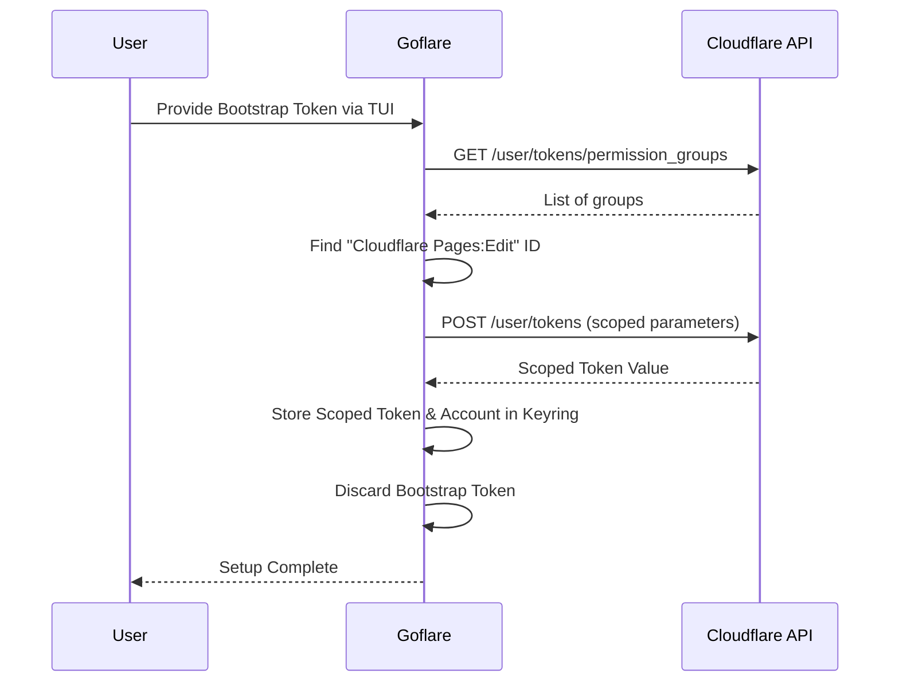

# Auth Flow

```mermaid
sequenceDiagram
    participant User
    participant Goflare
    participant CF as Cloudflare API
    
    User->>Goflare: Provide Bootstrap Token via TUI
    Goflare->>CF: GET /user/tokens/permission_groups
    CF-->>Goflare: List of groups
    Goflare->>Goflare: Find "Cloudflare Pages:Edit" ID
    Goflare->>CF: POST /user/tokens (scoped parameters)
    CF-->>Goflare: Scoped Token Value
    Goflare->>Goflare: Store Scoped Token & Account in Keyring
    Goflare->>Goflare: Discard Bootstrap Token
    Goflare-->>User: Setup Complete
```
