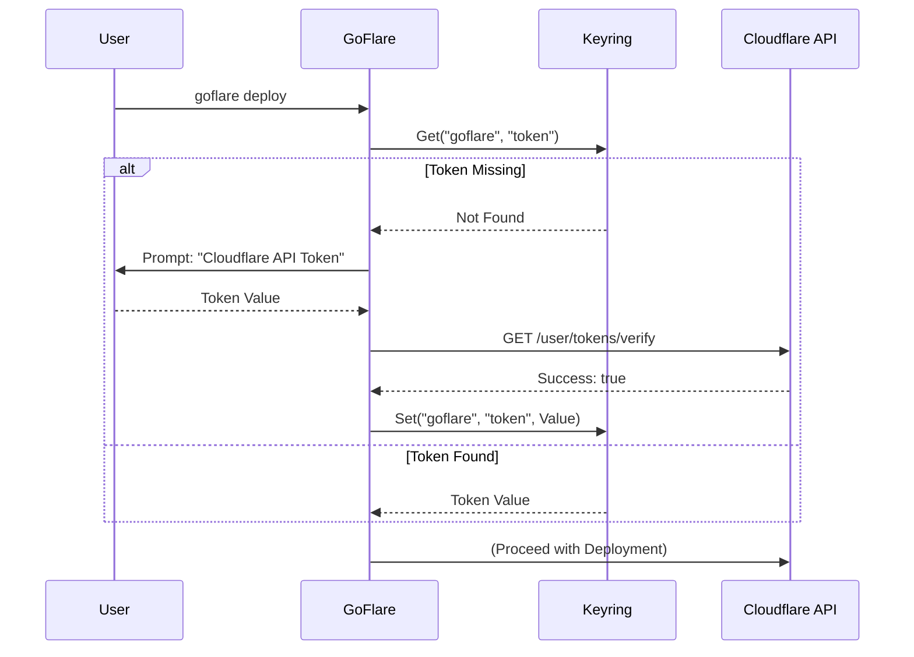

# Authentication Flow

```mermaid
sequenceDiagram
    participant U as User
    participant G as GoFlare
    participant K as Keyring
    participant CF as Cloudflare API

    U->>G: goflare deploy
    G->>K: Get("goflare", "token")
    alt Token Missing
        K-->>G: Not Found
        G->>U: Prompt: "Cloudflare API Token"
        U-->>G: Token Value
        G->>CF: GET /user/tokens/verify
        CF-->>G: Success: true
        G->>K: Set("goflare", "token", Value)
    else Token Found
        K-->>G: Token Value
    end
    G->>CF: (Proceed with Deployment)
```
