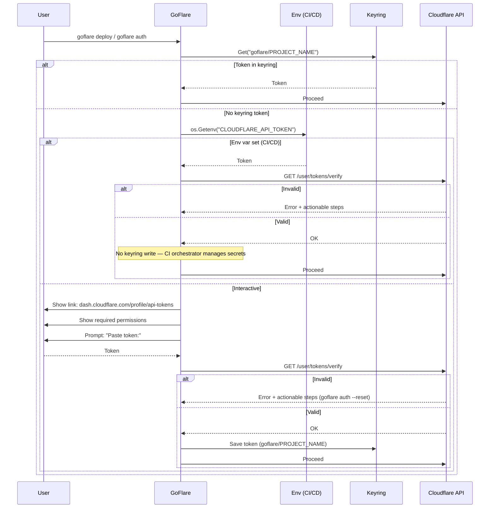

# Authentication Flow



## goflare auth subcommands

```
goflare auth           # guarda/verifica token (interactivo si no hay token)
goflare auth --reset   # borra token del keyring, pide uno nuevo en el próximo deploy
goflare auth --check   # verifica token guardado sin pedir nada, exit 0/1
```
