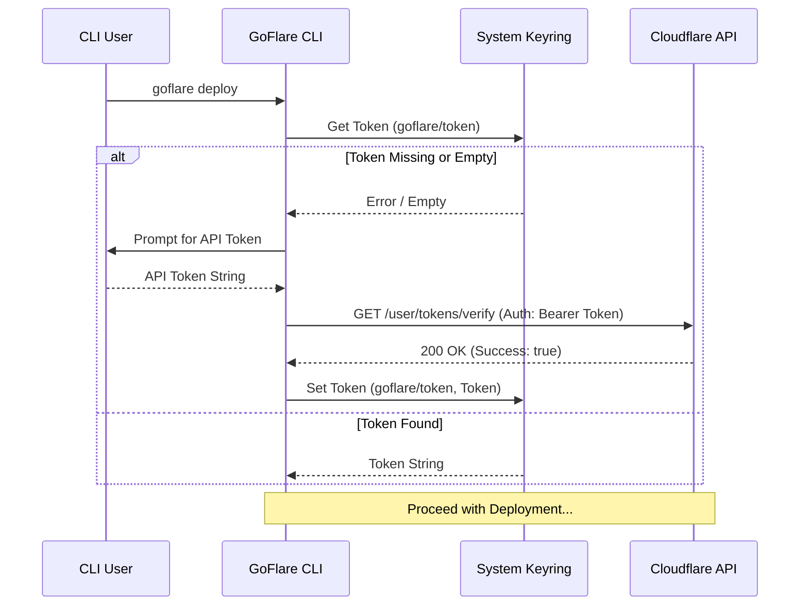

# Authentication Flow Diagram

This diagram illustrates the direct token authentication flow used by GoFlare for Cloudflare API interaction.

```mermaid
sequenceDiagram
    participant User as CLI User
    participant Goflare as GoFlare CLI
    participant Keyring as System Keyring
    participant CF as Cloudflare API

    User->>Goflare: goflare deploy
    Goflare->>Keyring: Get Token (goflare/token)
    
    alt Token Missing or Empty
        Keyring-->>Goflare: Error / Empty
        Goflare->>User: Prompt for API Token
        User-->>Goflare: API Token String
        Goflare->>CF: GET /user/tokens/verify (Auth: Bearer Token)
        CF-->>Goflare: 200 OK (Success: true)
        Goflare->>Keyring: Set Token (goflare/token, Token)
    else Token Found
        Keyring-->>Goflare: Token String
    end

    Note over Goflare,CF: Proceed with Deployment...
```
