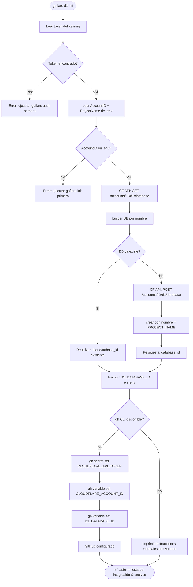

# Flow: goflare d1 init — Setup automático de D1 + GitHub Secrets

## Objetivo

El dev/agente ejecuta **un solo comando** y obtiene:
- D1 database creada (o reutilizada si ya existe)
- `.env` actualizado con `D1_DATABASE_ID`
- Los 3 secrets configurados en GitHub Actions automáticamente

## Prerequisitos (ya resueltos por el flujo normal de goflare)

| Valor | Fuente | Sensible |
|-------|--------|---------|
| `CLOUDFLARE_API_TOKEN` | Keyring del SO — set via `goflare auth` | ✅ Secret |
| `CLOUDFLARE_ACCOUNT_ID` | `.env` — set via `goflare init` (ver [.env.example](../../.env.example)) | ❌ Variable pública |
| `PROJECT_NAME` | `.env` — set via `goflare init` | ❌ Variable pública |

`CLOUDFLARE_ACCOUNT_ID` es un identificador público (visible en la URL del dashboard CF).
No es un secreto — puede commitearse en `.env.example` y configurarse como GitHub Variable (no Secret).

## Comando propuesto

```bash
goflare d1 init [--db-name=<name>]
# --db-name opcional — default: PROJECT_NAME
```

## Flujo



## Por qué este flujo y no otro

### ¿Por qué no pedir `CLOUDFLARE_ACCOUNT_ID` al token?

La CF API `GET /accounts` retorna las cuentas accesibles por el token, pero un token puede
tener acceso a múltiples cuentas. `goflare init` ya lo pide una sola vez y lo guarda en `.env`.
Leerlo de `.env` es directo y sin ambigüedad.

### ¿Por qué `gh` CLI para los GitHub secrets?

Los GitHub secrets requieren cifrado con NaCl/libsodium (cada repo tiene una clave pública
diferente). Implementarlo en Go añade una dependencia de criptografía. `gh secret set` lo hace
internamente y ya está instalado en cualquier máquina de desarrollo Go con GitHub.

Si `gh` no está disponible, el comando imprime los valores listos para copiar — el dev pega
manualmente en GitHub (como en la imagen de referencia de [CI_D1_SECRETS.md](../CI_D1_SECRETS.md)).

### ¿Por qué reutilizar si la DB ya existe?

Idempotente — `goflare d1 init` se puede correr múltiples veces sin efecto secundario.
Útil cuando el dev perdió el `.env` o configuró un nuevo equipo.

## Cambios requeridos en goflare

| # | Archivo | Acción |
|---|---|---|
| 1 | `cloudflare.go` | Agregar `ListD1Databases`, `CreateD1Database` usando `cfClient` |
| 2 | `run.go` | Agregar `RunD1Init(envPath, dbName, out)` |
| 3 | `cmd/goflare/main.go` | Agregar subcomando `d1 init [--db-name]` |
| 4 | `config.go` | Agregar `D1DatabaseID`, `D1DatabaseName` a `Config`; leer `D1_DATABASE_ID` de `.env` |
| 5 | `init.go` | Actualizar `WriteEnvFile` para incluir `D1_DATABASE_ID` |

## CF API calls necesarias

```
# Listar DBs existentes
GET /accounts/{account_id}/d1/database
→ [{"uuid": "...", "name": "...", ...}]

# Crear nueva DB
POST /accounts/{account_id}/d1/database
Body: {"name": "my-db"}
→ {"uuid": "abc-123", "name": "my-db", ...}
```

## gh CLI calls

```bash
# Solo el token es Secret (cifrado, acceso restringido)
gh secret set CLOUDFLARE_API_TOKEN --body "$token" --repo org/repo

# AccountID y DatabaseID son públicos — GitHub Variable (no Secret)
gh variable set CLOUDFLARE_ACCOUNT_ID --body "$account_id" --repo org/repo
gh variable set D1_DATABASE_ID        --body "$db_id"      --repo org/repo
```

Ver [CI_D1_SECRETS.md](../CI_D1_SECRETS.md) para instrucciones manuales con capturas de pantalla.

`goflare` detecta el repo remoto con `git remote get-url origin` y lo pasa a `gh`.
