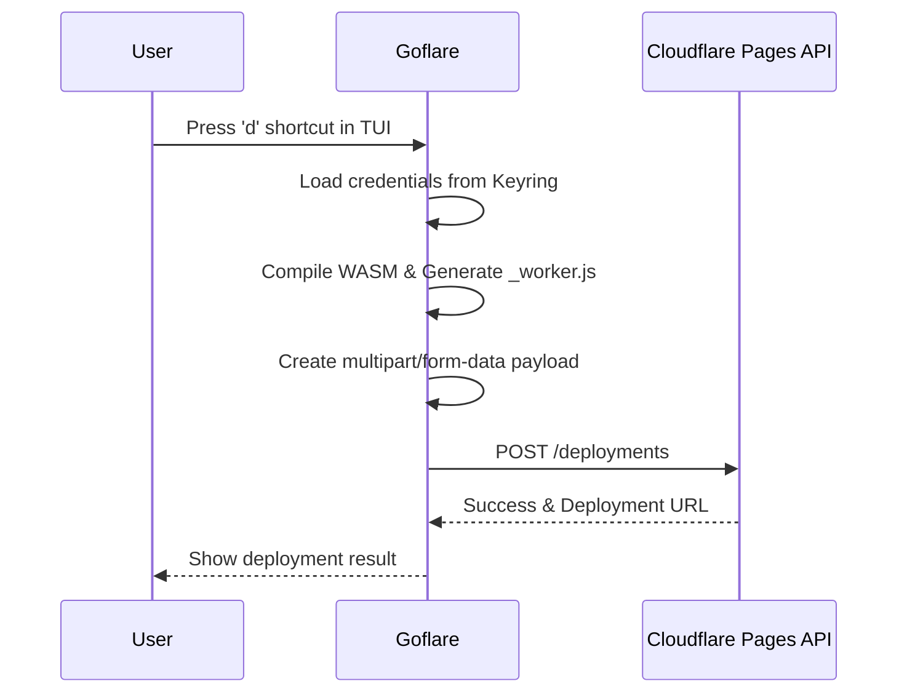

# Deploy Flow

```mermaid
sequenceDiagram
    participant User
    participant Goflare
    participant CF as Cloudflare Pages API
    
    User->>Goflare: Press 'd' shortcut in TUI
    Goflare->>Goflare: Load credentials from Keyring
    Goflare->>Goflare: Compile WASM & Generate _worker.js
    Goflare->>Goflare: Create multipart/form-data payload
    Goflare->>CF: POST /deployments
    CF-->>Goflare: Success & Deployment URL
    Goflare-->>User: Show deployment result
```
