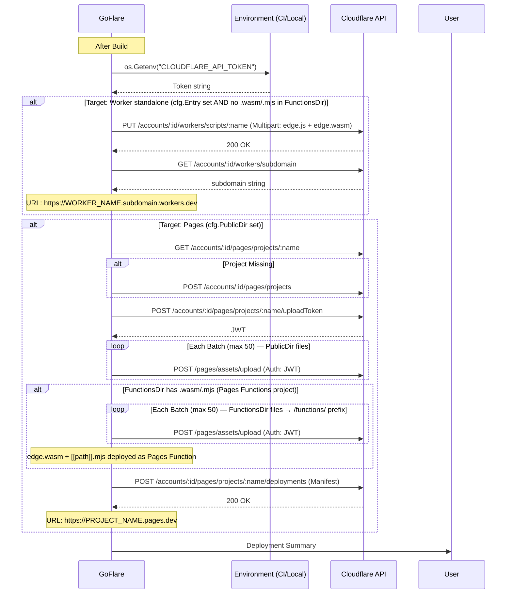

## Regla: Worker vs Pages Functions

| Condición | Comportamiento |
|---|---|
| `cfg.Entry != ""` + NO hay `.wasm`/`.mjs` en `FunctionsDir` | `DeployWorker` (Worker standalone) |
| `cfg.Entry != ""` + SÍ hay `.wasm`/`.mjs` en `FunctionsDir` | Solo `DeployPages` (edge como Pages Function) |
| Solo `cfg.PublicDir` | Solo `DeployPages` sin Functions |
