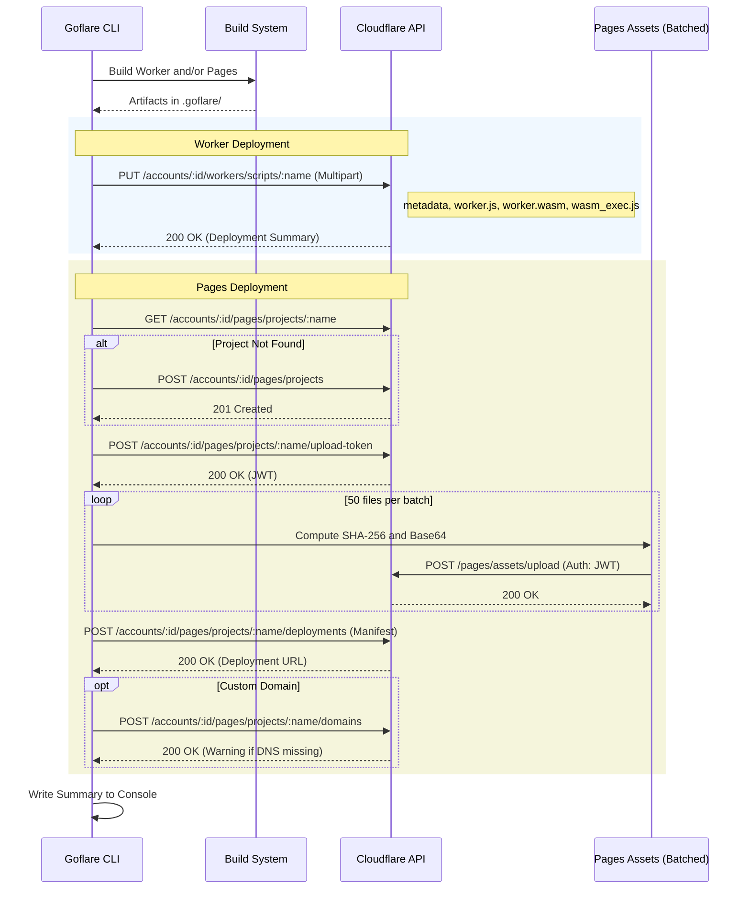

# Deployment Flow Diagram

This diagram outlines the deployment flow for both Workers and Pages in GoFlare.

```mermaid
sequenceDiagram
    participant CLI as Goflare CLI
    participant Build as Build System
    participant CF as Cloudflare API
    participant Pages as Pages Assets (Batched)

    CLI->>Build: Build Worker and/or Pages
    Build-->>CLI: Artifacts in .goflare/

    rect rgb(240, 248, 255)
        Note over CLI,CF: Worker Deployment
        CLI->>CF: PUT /accounts/:id/workers/scripts/:name (Multipart)
        Note right of CF: metadata, worker.js, worker.wasm, wasm_exec.js
        CF-->>CLI: 200 OK (Deployment Summary)
    end

    rect rgb(245, 245, 220)
        Note over CLI,CF: Pages Deployment
        CLI->>CF: GET /accounts/:id/pages/projects/:name
        alt Project Not Found
            CLI->>CF: POST /accounts/:id/pages/projects
            CF-->>CLI: 201 Created
        end
        CLI->>CF: POST /accounts/:id/pages/projects/:name/upload-token
        CF-->>CLI: 200 OK (JWT)

        loop 50 files per batch
            CLI->>Pages: Compute SHA-256 and Base64
            Pages->>CF: POST /pages/assets/upload (Auth: JWT)
            CF-->>Pages: 200 OK
        end

        CLI->>CF: POST /accounts/:id/pages/projects/:name/deployments (Manifest)
        CF-->>CLI: 200 OK (Deployment URL)

        opt Custom Domain
            CLI->>CF: POST /accounts/:id/pages/projects/:name/domains
            CF-->>CLI: 200 OK (Warning if DNS missing)
        end
    end

    CLI->>CLI: Write Summary to Console
```
