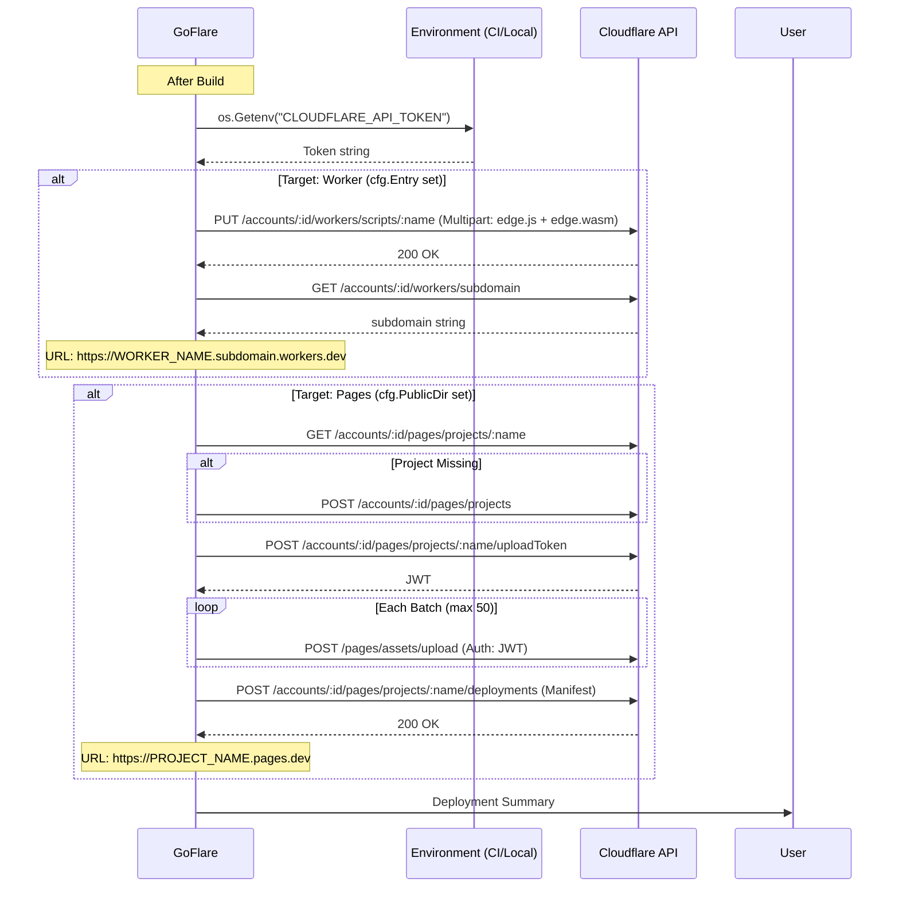

```mermaid
sequenceDiagram
    participant G as GoFlare
    participant ENV as Environment (CI/Local)
    participant CF as Cloudflare API

    Note over G: After Build

    G->>ENV: os.Getenv("CLOUDFLARE_API_TOKEN")
    ENV-->>G: Token string

    alt Target: Worker (cfg.Entry set)
        G->>CF: PUT /accounts/:id/workers/scripts/:name (Multipart: edge.js + edge.wasm)
        CF-->>G: 200 OK
        G->>CF: GET /accounts/:id/workers/subdomain
        CF-->>G: subdomain string
        Note over G: URL: https://WORKER_NAME.subdomain.workers.dev
    end

    alt Target: Pages (cfg.PublicDir set)
        G->>CF: GET /accounts/:id/pages/projects/:name
        alt Project Missing
            G->>CF: POST /accounts/:id/pages/projects
        end
        G->>CF: POST /accounts/:id/pages/projects/:name/uploadToken
        CF-->>G: JWT
        loop Each Batch (max 50)
            G->>CF: POST /pages/assets/upload (Auth: JWT)
        end
        G->>CF: POST /accounts/:id/pages/projects/:name/deployments (Manifest)
        CF-->>G: 200 OK
        Note over G: URL: https://PROJECT_NAME.pages.dev
    end

    G->>User: Deployment Summary
```
