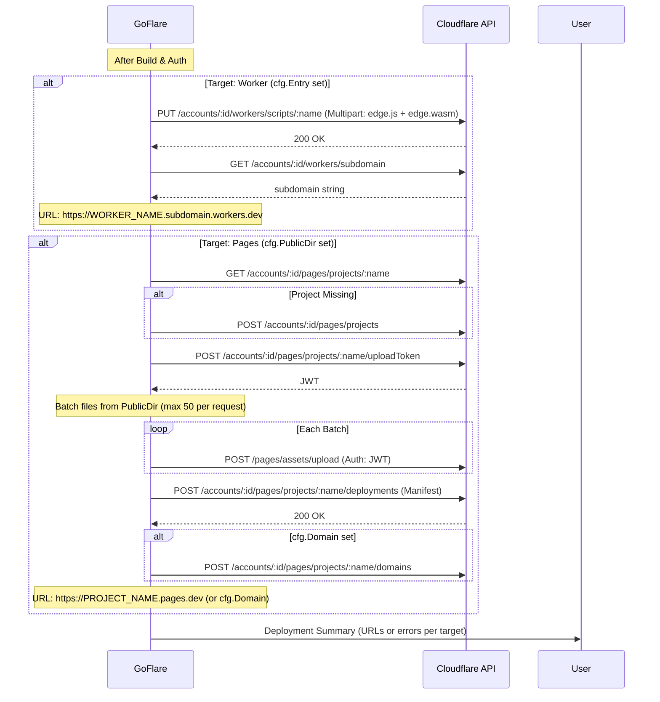

# Deployment Flow

```mermaid
sequenceDiagram
    participant G as GoFlare
    participant CF as Cloudflare API

    Note over G: After Build & Auth

    alt Target: Worker (cfg.Entry set)
        G->>CF: PUT /accounts/:id/workers/scripts/:name (Multipart: edge.js + edge.wasm)
        CF-->>G: 200 OK
        G->>CF: GET /accounts/:id/workers/subdomain
        CF-->>G: subdomain string
        Note over G: URL: https://WORKER_NAME.subdomain.workers.dev
    end

    alt Target: Pages (cfg.PublicDir set)
        G->>CF: GET /accounts/:id/pages/projects/:name
        alt Project Missing
            G->>CF: POST /accounts/:id/pages/projects
        end
        G->>CF: POST /accounts/:id/pages/projects/:name/uploadToken
        CF-->>G: JWT
        Note over G: Batch files from PublicDir (max 50 per request)
        loop Each Batch
            G->>CF: POST /pages/assets/upload (Auth: JWT)
        end
        G->>CF: POST /accounts/:id/pages/projects/:name/deployments (Manifest)
        CF-->>G: 200 OK
        alt cfg.Domain set
            G->>CF: POST /accounts/:id/pages/projects/:name/domains
        end
        Note over G: URL: https://PROJECT_NAME.pages.dev (or cfg.Domain)
    end

    G->>User: Deployment Summary (URLs or errors per target)
```
