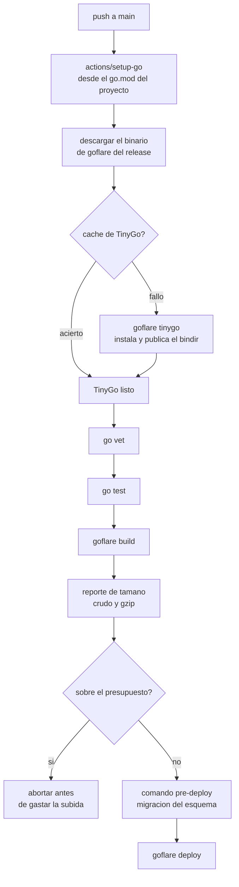

```mermaid
flowchart TD
    A[push a main] --> B[actions/setup-go<br/>desde el go.mod del proyecto]
    B --> C[descargar el binario<br/>de goflare del release]
    C --> D{cache de TinyGo?}
    D -->|acierto| F[TinyGo listo]
    D -->|fallo| E[goflare tinygo<br/>instala y publica el bindir]
    E --> F
    F --> G[go vet]
    G --> H[go test]
    H --> I[goflare build]
    I --> J[reporte de tamano<br/>crudo y gzip]
    J --> K{sobre el presupuesto?}
    K -->|si| L[abortar antes<br/>de gastar la subida]
    K -->|no| M[comando pre-deploy<br/>migracion del esquema]
    M --> N[goflare deploy]
```

## Regla: Despliegue único

| Condición | Comportamiento |
|---|---|
| Solo `cfg.PublicDir` | Assets subidos + Worker sin `main_module` |
| Solo `cfg.Entry` | Script Worker (`edge.js` + `edge.wasm`) sin key `assets` |
| Ambos (`cfg.Entry` + `cfg.PublicDir`) | Assets subidos + Script Worker con `run_worker_first` |
