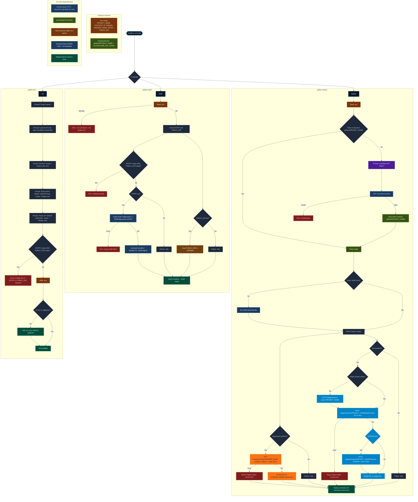

```mermaid
flowchart TD
    classDef cmd fill:#0f172a,stroke:#38bdf8,color:#e0f2fe
    classDef detect fill:#1e293b,stroke:#94a3b8,color:#cbd5e1
    classDef compile fill:#1e3a5f,stroke:#38bdf8,color:#e0f2fe
    classDef front fill:#713f12,stroke:#facc15,color:#fef9c3
    classDef output fill:#064e3b,stroke:#34d399,color:#d1fae5
    classDef auth fill:#4c1d95,stroke:#a78bfa,color:#ede9fe
    classDef error fill:#7f1d1d,stroke:#f87171,color:#fecaca
    classDef cf fill:#f97316,stroke:#fdba74,color:#1e293b
    classDef cfpages fill:#0284c7,stroke:#7dd3fc,color:#e0f2fe
    classDef key fill:#365314,stroke:#84cc16,color:#ecfccb
    classDef sdk fill:#1e3a5f,stroke:#38bdf8,color:#bae6fd
    classDef env fill:#78350f,stroke:#f59e0b,color:#fef3c7

    USER(["$ goflare comando"]):::cmd
    USER --> CMD_SWITCH{"Comando"}:::detect
    CMD_SWITCH --> CMD_INIT["init"]:::cmd
    CMD_SWITCH --> CMD_BUILD["build"]:::cmd
    CMD_SWITCH --> CMD_DEPLOY["deploy"]:::cmd

    %% GOFLARE INIT
    subgraph INIT ["goflare init"]
        direction TB
        CMD_INIT --> ASK_NAME["Prompt: Project name?"]:::detect
        ASK_NAME --> ASK_ACC["Prompt: Account ID? see: dash.cloudflare.com/profile"]:::detect
        ASK_ACC --> ASK_DOMAIN["Prompt: Domain? empty = workers.dev only"]:::detect
        ASK_DOMAIN --> ASK_ENTRY["Prompt: Entry point? default: web/server.go  empty = Pages only"]:::detect
        ASK_ENTRY --> ASK_PUBLIC["Prompt: Public dir? default: web/public  empty = Worker only"]:::detect
        ASK_PUBLIC --> VALIDATE_INIT{"ENTRY empty AND PUBLIC_DIR empty?"}:::detect
        VALIDATE_INIT -->|Yes| ERR_INIT["Error: at least one of ENTRY or PUBLIC_DIR required"]:::error
        VALIDATE_INIT -->|No| WRITE_ENV["Write .env"]:::env
        WRITE_ENV --> GI_CHECK{"Is .env in .gitignore?"}:::detect
        GI_CHECK -->|No| GI_ADD["Add .env and .build/ to .gitignore"]:::output
        GI_CHECK -->|Yes| INIT_DONE["Init complete"]:::output
        GI_ADD --> INIT_DONE
    end

    %% GOFLARE BUILD
    subgraph BUILD ["goflare build"]
        direction TB
        CMD_BUILD --> READ_ENV_B["Read .env"]:::env
        READ_ENV_B -->|Missing| ERR_ENV["Error: .env not found - run goflare init"]:::error
        READ_ENV_B -->|OK| SCAN["Check ENTRY and PUBLIC_DIR"]:::detect

        SCAN --> BOTH_EMPTY{"ENTRY empty AND PUBLIC_DIR empty?"}:::detect
        BOTH_EMPTY -->|Yes| ERR_EMPTY["Error: nothing to build"]:::error
        BOTH_EMPTY -->|No| HAS_BACK{"ENTRY set?"}:::detect

        HAS_BACK -->|Yes| TINYGO["tinygo build -target=wasi -o .build/edge.wasm ENTRY"]:::compile
        HAS_BACK -->|No| SKIP_W["Worker: skip"]:::detect

        TINYGO -->|Error| ERR_BUILD["Error: tinygo build failed"]:::error
        TINYGO -->|OK| GEN_JS["Generate bundled + minified JS: .build/edge.js"]:::compile

        SCAN --> HAS_FRONT{"PUBLIC_DIR set?"}:::detect
        HAS_FRONT -->|Yes| COPY_DIST["Copy PUBLIC_DIR to .build/dist/"]:::front
        HAS_FRONT -->|No| SKIP_P["Pages: skip"]:::detect

        GEN_JS --> BUILD_DONE["Build complete - .build/ ready"]:::output
        COPY_DIST --> BUILD_DONE
        SKIP_W --> BUILD_DONE
        SKIP_P --> BUILD_DONE
    end

    %% GOFLARE DEPLOY
    subgraph DEPLOY_FLOW ["goflare deploy"]
        direction TB
        CMD_DEPLOY --> D_ENV["Read .env"]:::env
        D_ENV --> D_AUTH{"Token in keyring? goflare/PROJECT_NAME"}:::detect
        D_AUTH -->|Yes| TOK_OK["Token ready"]:::key
        D_AUTH -->|No| TOK_ASK["Prompt: Cloudflare API Token?"]:::auth
        TOK_ASK --> TOK_VERIFY["GET /user/tokens/verify"]:::sdk
        TOK_VERIFY -->|Invalid| TOK_ERR["Error: invalid token"]:::error
        TOK_VERIFY -->|Valid| TOK_SAVE["Save token: keyring goflare/PROJECT_NAME"]:::key
        TOK_SAVE --> TOK_OK

        TOK_OK --> D_BUILD_CHECK{"Does .build/ exist?"}:::detect
        D_BUILD_CHECK -->|No| AUTO_BUILD["Run build automatically"]:::compile
        D_BUILD_CHECK -->|Yes| D_TARGETS["Detect deploy targets"]:::detect
        AUTO_BUILD --> D_TARGETS

        D_TARGETS --> D_HAS_WASM{"edge.wasm present?"}:::detect
        D_TARGETS --> D_HAS_DIST{"dist/ present?"}:::detect

        D_HAS_WASM -->|Yes| W_UPLOAD["PUT /workers/scripts/WORKER_NAME multipart: edge.js + edge.wasm"]:::cf
        D_HAS_WASM -->|No| W_SKIP["Worker: skip"]:::detect

        W_UPLOAD -->|Error| W_ERR["Worker deploy failed - record error"]:::error
        W_UPLOAD -->|OK| W_DONE["Worker live on WORKER_NAME.workers.dev"]:::cf

        D_HAS_DIST -->|Yes| P_CHECK{"Pages project exists?"}:::detect
        D_HAS_DIST -->|No| P_SKIP["Pages: skip"]:::detect
        P_CHECK -->|No| P_CREATE["POST /pages/projects name=PROJECT_NAME"]:::cfpages
        P_CHECK -->|Yes| P_UPLOAD["POST /pages/projects/PROJECT_NAME/deployments ZIP of dist/"]:::cfpages
        P_CREATE --> P_UPLOAD
        P_UPLOAD -->|Error| P_ERR["Pages deploy failed - record error"]:::error
        P_UPLOAD -->|OK| P_DOMAIN{"DOMAIN set?"}:::cfpages
        P_DOMAIN -->|Yes| P_DOMAINSET["POST /pages/projects/PROJECT_NAME/domains DOMAIN - warn if fails"]:::cfpages
        P_DOMAIN -->|No| P_DONE["Pages live on pages.dev"]:::cfpages
        P_DOMAINSET --> P_DONE

        W_DONE --> RESULT["Deploy summary: list successes and errors"]:::output
        W_SKIP --> RESULT
        W_ERR --> RESULT
        P_DONE --> RESULT
        P_SKIP --> RESULT
        P_ERR --> RESULT
    end

    subgraph CONFIG ["Config vs Secrets"]
        direction LR
        C_ENV[".env config: PROJECT_NAME, ACCOUNT_ID, DOMAIN, WORKER_NAME, ENTRY, PUBLIC_DIR"]:::env
        C_KEY["Keyring secrets: goflare/PROJECT_NAME = CLOUDFLARE_API_TOKEN"]:::key
    end

    subgraph DEPS ["Go-only Dependencies"]
        direction LR
        D1["cfClient direct HTTP - baseURL injectable for tests"]:::sdk
        D2["go-keyring OS secrets"]:::key
        D3["bufio.Scanner stdlib .env parser"]:::env
        D4["tinywasm/client WASM build + JS templates"]:::compile
        D5["httptest.Server mock in tests"]:::output
    end
```
